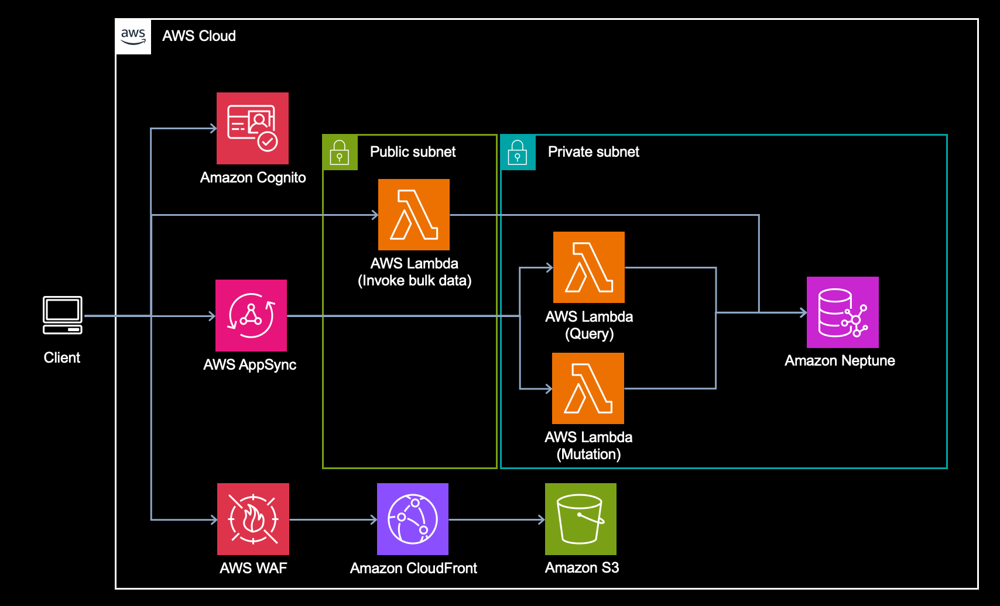

# Graph Application using Amazon Neptune

## Architecture overview



## Prerequisites

- Node.js >= 18.19.0
- An AWS Account
- AWS CDK CLI
- Configuration and credential file settings
  - See [the doc](https://docs.aws.amazon.com/cli/latest/userguide/cli-configure-files.html) in detail
- Docker
- Stored `vertex.csv` and `edge.csv` files in Amazon S3 in your AWS Account as [the post](https://aws.amazon.com/blogs/database/build-a-graph-application-with-amazon-neptune-and-aws-amplify/) mentioned

## Setup

### Create a config file as `config.ts`

Copy `config.sample.ts` and paste the file as `config.ts`. Then modify the `baseConfig` properties as your enviroment and requirements. For the reference, `baseConfig` in the sample file as follows:

```ts
const baseConfig = {
  appName: "graphApp",
  region: "us-east-1",
  adminEmail: "your_email@acme.com",
  allowedIps: [],
  wafParamName: "graphAppWafWebACLID",
  webBucketsRemovalPolicy: RemovalPolicy.DESTROY,
  s3Uri: {
    edge: "EDGE_S3_URI",
    vertex: "VERTEX_S3_URI",
  },
};
```

See the [config doc](docs/config.md) if you check the properties in detail.

## Deployment

1. Install the dependencies

```zsh
npm ci
```

2. Deploy backend

```zsh
## Execute the bootstrapping if you have never executed bootstrap command with CDK in your region.
npm run cdk bootstrap -- --profile <YOUR_AWS_PROFILE>

## Also execute the bootstrapping command for us-east-1 if your region is different from `us-east-1`
npm run cdk bootstrap -- --profile <YOUR_AWS_PROFILE> --region us-east-1

npm run deployBackend -- --all --profile <YOUR_AWS_PROFILE>
```

You can see the following outputs after backend deployment.

```zsh
Outputs:
graphApp-ApiStack.apiFunctionUrlAAAA = https://aaaa.lambda-url.us-east-1.on.aws/
graphApp-ApiStack.apiGraphqlUrlBBBB = https://bbbb.appsync-api.us-east-1.amazonaws.com/graphql
graphApp-ApiStack.cognitoIdentityPoolIdXXXX = us-east-1:xxxx
graphApp-ApiStack.cognitoUserPoolClientIdYYYY = yyyy
graphApp-ApiStack.cognitoUserPoolIdZZZZ = us-east-1_zzzz
```

3. Generate env file for React

```zsh
npm run generateEnv
```

4. Deploy frontend

```zsh
npm run deployFrontend -- --all --profile <YOUR_AWS_PROFILE>
```

You can see the graph application url as follows.

```zsh
Outputs:
graphApp-WebappStack.webappurl4CF7BBD7 = xyz.cloudfront.net
```

## Bulk load with Lambda function URL

Invoking the function url in AWS Lambda can do bulk load from S3 stored `edge.csv` and `vertex.csv` to Amazon Neptune. You can see the function url after deploying backend.

```zsh
Outputs:
graphApp-ApiStack.apiFunctionUrlAAAA = https://aaaa.lambda-url.us-east-1.on.aws/
```

Set the variables as follows, and then invoke the function url with `curl`.

```zsh

export AWS_ACCESS_KEY_ID="YOUR_ACCESS_KEY"
export AWS_SECRET_ACCESS_KEY="YYY"
export AWS_SESSION_TOKEN="ZZZZ"
export FUNCTION_URL="YOUR_FUNCTION_URL"
curl  ${FUNCTION_URL} \
  -H "X-Amz-Security-Token: ${AWS_SESSION_TOKEN}" \
  --aws-sigv4 "aws:amz:us-east-1:lambda" \
  --user "${AWS_ACCESS_KEY_ID}:${AWS_SECRET_ACCESS_KEY}"


Start streaming response
Start bulk load of s3://YOUR_BUCKET/vertex.csv
Load status checking of s3://YOUR_BUCKET/vertex.csv
Waiting for load status change ................................
Load completed
200 OK
Start bulk load of s3://YOUR_BUCKET/edge.csv
Load status checking of s3://YOUR_BUCKET/edge.csv
Waiting for load status change ............................................................................................
Load completed
200 OK
End streaming response%
```

## Useful commands

- `npm run deployBackend`
  - Deploy the infrastructure stack with AWS CDK
- `npm run deployFrontend`
  - Deploy the frontend stack with AWS CDK
- `npm run destroyBackend`
  - Destroy the infrastructure stack with AWS CDK
- `npm run destroyFrontend`
  - Destroy the frontend stack with AWS CDK
- `npm run generateEnv`
  - Generate the environment variables in `.env` for frontend.

## Security

See [CONTRIBUTING](CONTRIBUTING.md#security-issue-notifications) for more
information.

## License

This code is licensed under the MIT-0 License. See [the LICENSE file](LICENSE).
